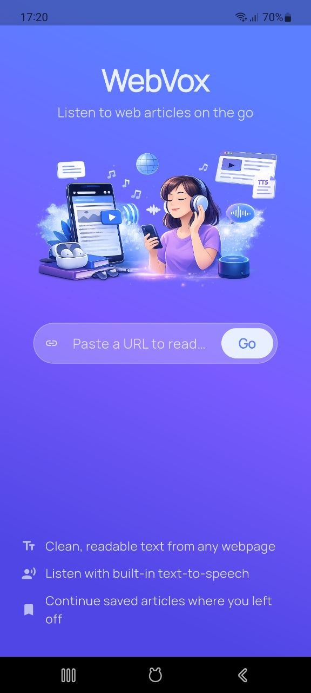
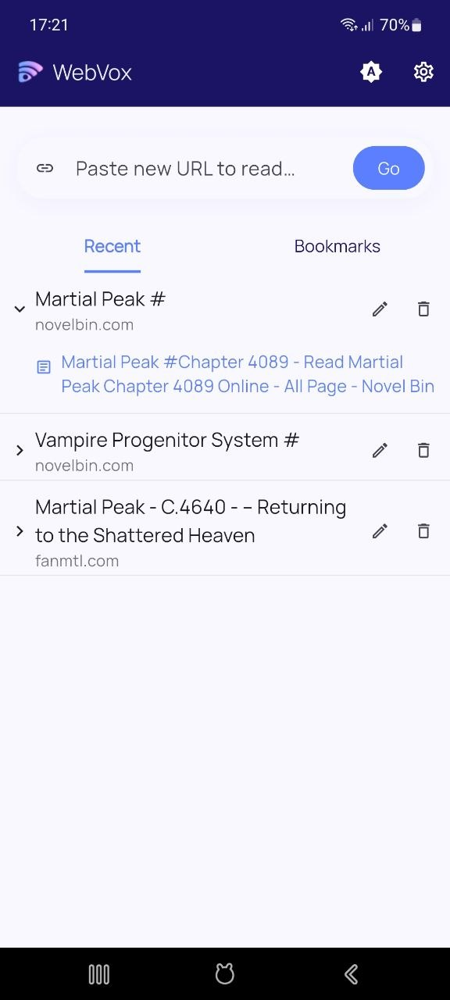
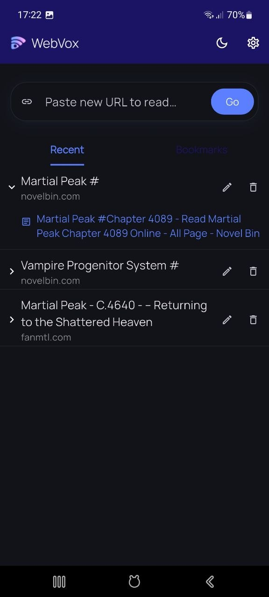

# WebVox

<p align="center">
  
</p>

<p align="center">
  <strong>Listen to the web.</strong><br>
  A clean, open-source reader mode and text-to-speech app for Android.
</p>

<p align="center">
  Paste a URL or share directly from your browser — WebVox transforms cluttered web pages into a clean, immersive listening experience.
</p>

<p align="center">
  <a href="https://play.google.com/store/apps/details?id=app.alkyo.webreader&hl=en">Download WebVox on Google Play</a>
</p>

---

## Preview

<p align="center">
  
</p>

<p align="center">
  
  
</p>

<p align="center">
  
  
</p>

---

## Features

### Clean Reader Mode

- Removes ads, popups, sidebars, and unnecessary clutter
- Extracts article title, author, and readable content
- Optimized typography for long reading sessions

### Built-in Text-to-Speech

- Reads articles aloud using Android system TTS
- Word-by-word highlighting during playback
- Adjustable speed, pitch, voice, and language

### Background Playback

- Continue listening with the screen off
- Lock-screen and notification controls
- Headset and Bluetooth media button support

### Smart Reading Experience

- Automatically detects previous/next article links
- Optional auto-next article playback
- Background caching for faster article loading

### Bookmarks & Reading History

- Save articles for later
- Resume from where you left off
- Quickly revisit recent articles

### Share Integration

- Share URLs directly from your browser to WebVox
- Share article links back out from WebVox

### Customization

- Light / dark / system theme
- Adjustable reader font size
- Auto-play and auto-next preferences

---

## Why WebVox?

Most text-to-speech apps feel:
- cluttered
- overly technical
- subscription-heavy
- focused on AI voices instead of reading experience

WebVox focuses on:
- simplicity
- readability
- immersive listening
- fast article loading
- privacy-friendly usage

No accounts. No ads. No unnecessary complexity.

---

## Requirements

- Android only
- Flutter SDK `>=3.7.0`
- Android device with a TTS engine installed
  - Google Speech Services recommended

---

## Setup

### 1. Clone the repository

```bash
git clone <repo-url>
cd WebVox
```

### 2. Install dependencies

```bash
flutter pub get
```

### 3. Run the app

```bash
flutter run
```

### 4. Build release APK

```bash
flutter build apk --release
```

Release APK output:

```text
build/app/outputs/flutter-apk/
```

---

## Release Script

To build a release package automatically:

```bash
./scripts/build-release.sh
```

This script:

- increments the build number
- builds the release APK
- copies artifacts into `dist/`
- generates:
  - versioned APK
  - `web_reader-latest.apk`

---

## App Icon

The launcher icon is generated from:

```text
assets/appicon-128.png
```

To regenerate launcher icons:

```bash
dart run flutter_launcher_icons
```

---

## Architecture

| Layer | Location | Responsibility |
|---|---|---|
| Domain | `lib/domain/` | Entities and repository interfaces |
| Data | `lib/data/` | HTTP fetching, parsing, persistence |
| Presentation | `lib/presentation/` | Screens, widgets, Riverpod state |

---

## Tech Stack

| Package | Purpose |
|---|---|
| `flutter_riverpod` | State management |
| `flutter_tts` | Android TTS |
| `audio_service` | Background playback & media session |
| `sqflite` | Local database |
| `http` | Web requests |
| `html` | HTML parsing |
| `receive_sharing_intent` | Receive shared URLs |
| `share_plus` | Share article links |

---

## Reporting Issues

Please include:

- Android version
- Device model
- App version
- Steps to reproduce
- Problematic article URL (if applicable)
- Relevant logs or screenshots

---

## Contributing

Contributions are welcome.

Before submitting a pull request:

1. Fork the repository
2. Create a feature branch from `main`
3. Keep changes focused and minimal
4. Run:

```bash
flutter analyze
flutter test
```

5. Clearly explain the motivation and implementation details

For major changes, please open an issue first to discuss the proposal.

---

## Roadmap

Planned improvements:

- Better article extraction
- Offline article downloads
- Tablet layout optimization
- Material You support
- Improved playback queue
- More reader customization
- Enhanced accessibility support

---

## License

This project is licensed under the MIT License.

---

## Trademark Notice

The name **WebVox** and the WebVox logo are trademarks of the author.

You may fork and modify the source code under the MIT License, but you may not redistribute modified versions using the original branding without permission.